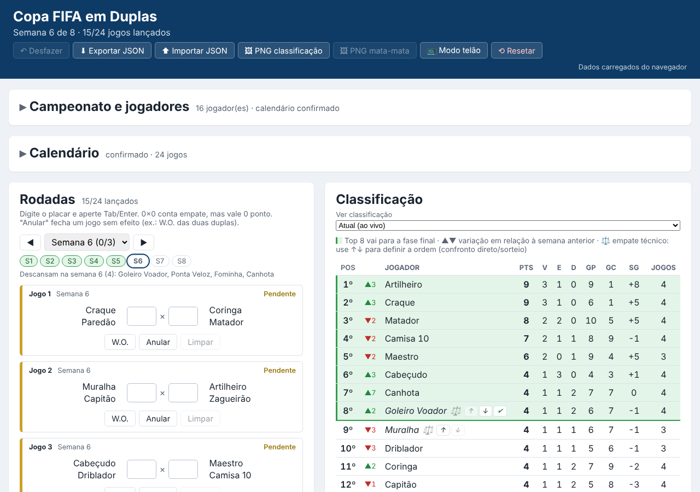

# Copa FIFA em Duplas

A small web app to run a 2v2 FIFA tournament from start to finish: sign up the players, draw the whole schedule, enter the scores week by week, follow the individual standings live and run the knockout stage up to a best-of-3 final.

## What it does

- **Players and settings:** sign up players and choose points per result, games per player and number of weeks.
- **Schedule draw:** draws every week at once. Everyone plays the same number of games, at most once per week, and never with the same partner twice. A seed makes the draw reproducible, and players can be swapped by hand before confirming.
- **Rounds:** enter scores, walkovers or voided games week by week.
- **Standings:** individual table, live or at the end of any week, with tiebreakers and manual ordering for full ties.
- **What's at stake:** shows who is already through, who is still fighting and who is out, by checking every possible result of the remaining games.
- **Knockout stage:** semifinals, 3rd place match and a best-of-3 final, with extra time and penalties.
- **Sharing:** exports the standings and the bracket as PNG images and has a TV mode that rotates the screens.
- **Backup:** saves in the browser, exports and imports JSON, and reminds you to back up.

## Built with

- HTML, CSS and plain JavaScript (no frameworks, no build step, no dependencies)
- Canvas API for the PNG images
- `localStorage` for saving data in the browser
- A browser test page (`testes.html`) covering the rules

## How to run

1. Download or clone this repository.
2. Double-click `index.html`. It opens in Chrome or Edge and works offline.
3. To run the tests, double-click `testes.html`. The page shows how many tests passed.

## Status

Working. It was used to run a real tournament. Known limits and open points are listed in [`docs/ESCOPO.md`](docs/ESCOPO.md).

## License

MIT. See [`LICENSE`](LICENSE).

🇧🇷 Versão em português

# Copa FIFA em Duplas

Um aplicativo web simples para conduzir um campeonato de FIFA em duplas do começo ao fim: cadastrar os jogadores, sortear o calendário inteiro, lançar os placares semana a semana, acompanhar a classificação individual ao vivo e conduzir o mata-mata até a final em melhor de 3.

## O que faz

- **Jogadores e configuração:** cadastro de jogadores e escolha dos pontos por resultado, jogos por jogador e número de semanas.
- **Sorteio do calendário:** sorteia todas as semanas de uma vez. Todos jogam o mesmo número de jogos, no máximo uma vez por semana, e nunca repetem parceiro. Uma semente torna o sorteio reproduzível, e dá para trocar jogadores à mão antes de confirmar.
- **Rodadas:** lançamento de placares, W.O. ou jogos anulados, semana a semana.
- **Classificação:** tabela individual, ao vivo ou ao fim de qualquer semana, com critérios de desempate e ordem manual para empates totais.
- **O que está em jogo:** mostra quem já está garantido, quem ainda disputa e quem está eliminado, testando todos os resultados possíveis dos jogos que faltam.
- **Mata-mata:** semifinais, disputa de 3º lugar e final em melhor de 3, com prorrogação e pênaltis.
- **Compartilhar:** exporta a classificação e o chaveamento como imagens PNG e tem um modo telão que alterna as telas.
- **Backup:** salva no navegador, exporta e importa JSON e lembra de fazer backup.

## Tecnologias

- HTML, CSS e JavaScript puro (sem frameworks, sem build, sem dependências)
- Canvas API para as imagens PNG
- `localStorage` para salvar os dados no navegador
- Página de testes no navegador (`testes.html`) cobrindo as regras

## Como rodar

1. Baixe ou clone este repositório.
2. Dê duplo clique no `index.html`. Ele abre no Chrome ou no Edge e funciona offline.
3. Para rodar os testes, dê duplo clique no `testes.html`. A página mostra quantos testes passaram.

## Status

Funcionando. Já foi usado para conduzir um campeonato de verdade. Os limites conhecidos e os pontos em aberto estão em [`docs/ESCOPO.md`](docs/ESCOPO.md).

## Licença

MIT. Veja o arquivo [`LICENSE`](LICENSE).

